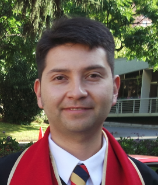

{width=100px}

## About

Hi! my name is Manfredo Novella. I am a chilean electric engineer with a master degree in networks and telecommunications.

My professional career was almost entirely ran in Entel.

## Interests

I am interesting in Big Data analysis
I am interestin in eco-technologies

## Projects

Nowadays I am learning to use tools that I belive are going to be crucial to prevent obsolescence like: Eglish language, Big Data analysis, automatation and AI.

This is the website https://shingenesis.github.io/ of my CBDS courses

## Profiles 

* [LinkedIn](https://www.linkedin.com/in/manfredo-novella-03822b22/)
* ...
* [GitHub](http://github.com/shingenesis)

## Contact

* [manfredo.novella@gmail](mailto:manfredo.novella@gmail)
